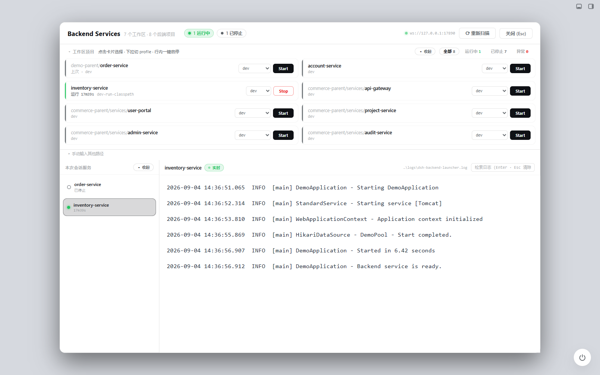

<div align="center">

# DSH Spring Boot Launcher

**让 DeepSeek Harness 像 IDE 一样发现、启动和管理 Maven Spring Boot 服务**


[](LICENSE)

[快速开始](#快速开始) · [功能](#功能) · [兼容性](#兼容性) · [安全边界](#安全边界) · [开发与测试](#开发与测试)

</div>

DSH Spring Boot Launcher 是面向 Maven Spring Boot 项目的专用启动器。它提供 Agent 工具和 Web 管理面板，用同一套进程管理逻辑完成项目检查、Profile 选择、启停、状态查询和日志查看。

> 当前版本为 `0.0.1-spike` / Alpha，尚未发布 npm 公共包，也不承诺稳定 API。真实项目启停和日志能力已在 Windows 11、PowerShell 7 环境验证。



## 功能

- **发现项目**：识别 Maven 工程及多模块结构中的 Spring Boot 应用。
- **检查运行条件**：解析入口类、Spring Profile、端口、JDK 和构建产物状态。
- **集中启停**：在管理面板中选择 Profile，启动或停止由插件托管的服务。
- **实时日志**：通过 WebSocket 查看日志，并写入项目的 `logs/dsh-spring-boot-launcher.log`。
- **运行模式决策**：根据源码和构建产物的新旧程度选择 `jar-run`、`direct-classpath` 或编译后启动。
- **多模块处理**：优先复用工作区兄弟模块产物，并处理常见 classpath 冲突。
- **原生认证**：复用 DSH 登录状态和同源 HTTP/WS 通道，不建立第二套令牌系统。

## 兼容性

| 能力 | 当前状态 |
| --- | --- |
| Windows 11 + PowerShell 7 | 已验证 |
| Maven + Spring Boot | 已验证 |
| Maven 多模块 Spring Boot | 已验证 |
| Gradle Spring Boot | 当前不支持 |
| Linux / macOS | 尚未验证，不属于当前支持范围 |
| 其他服务类型 | 不属于本项目定位 |

“尚未验证”不代表确定无法运行，但在完成真实环境验证前不会宣传为受支持平台。

## 快速开始

仓库包含两个需要同时加载的包：

```text
dsh-spring-boot-launcher/       Host：项目检查、启动决策、进程与日志
dsh-spring-boot-launcher-ui/    Client：Spring Boot Services 管理面板
```

详细的 Junction 创建命令和 DSH 加载配置见 [插件使用说明](dsh-spring-boot-launcher/README.md#安装与加载)。完成配置后需要完整重启 DSH，再刷新已登录的本机页面。

侧栏出现 **Spring Boot** 后，可以在面板中扫描工作区、选择 Profile 并启动服务，也可以让 Agent 调用以下工具：

| 工具 | 用途 |
| --- | --- |
| `spring_boot_inspect` | 检查入口类、JDK、Profile 和启动模式 |
| `spring_boot_start` | 准备并启动 Spring Boot 服务 |
| `spring_boot_status` | 查询已托管服务状态 |
| `spring_boot_logs` | 读取服务日志 |
| `spring_boot_stop` | 停止已托管服务 |

示例：

```text
检查 D:\workspace\demo-service，说明推荐的启动模式。
使用 dev profile 启动这个 Spring Boot 服务，端口设为 8081。
查看最近 100 行日志。
停止刚才启动的服务。
```

## 工作原理

```text
Agent 工具 ─────┐
                ├─> Spring Boot 进程引擎 ─> ctx.shell ─> Maven / JVM
Web 管理面板 ───┘               │
                                └─> 内存日志缓冲 + 项目日志文件
```

管理面板通过 DSH 已认证的 `/spring-boot-launcher` HTTP 路径和 `/spring-boot-launcher/ws` WebSocket 获取状态及日志。Host 与 UI 不开放额外监听端口。

## 安全边界

- 只启动可信工程。Maven 构建脚本和 Spring Boot 进程以当前用户权限运行，不是隔离沙箱。
- 控制通道只允许 DSH 本机回环、同源且已登录的请求。
- 日志可能包含应用输出的凭据或业务数据，公开 Issue 前必须脱敏。
- 插件不会主动终止未确认归属的端口占用进程。

完整说明和报告方式见 [SECURITY.md](SECURITY.md)。

## 开发与测试

在仓库根目录运行：

```powershell
npm ci --ignore-scripts --no-audit --no-fund
npm test
```

测试使用临时 Maven 工程和宿主替身，不要求本机安装 DSH、Maven 或 JDK，也不会执行 Java 或前端 build。Windows CI 配置位于 [`.github/workflows/test.yml`](.github/workflows/test.yml)。

## 已知限制

- 端口占用只能说明存在监听进程，不能证明它属于当前项目。
- 跨 DSH 会话的进程恢复、复杂 Maven 属性继承和更多配置格式仍需完善。
- Gradle 与 Linux/macOS 尚未进入当前支持范围。
- 现阶段仅分发源码，两个包仍标记为 `private`。

## 参与贡献

欢迎提交脱敏的最小复现、问题说明和回归测试。请先阅读 [CONTRIBUTING.md](CONTRIBUTING.md)，不要提交真实业务工程、访问凭据或未经审查的日志和截图。

## 许可证

[Apache License 2.0](LICENSE)。项目名称中的 DSH / DeepSeek Harness 仅用于说明集成对象，不表示官方背书。
